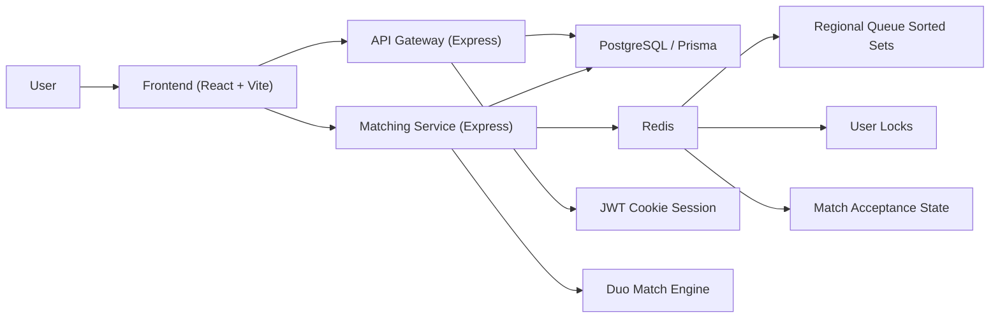

# Real-Time Matching System

A Valorant-style duo matching system with:

- `api-gateway` for auth and session management
- `matching-service` for real-time queueing and match acceptance
- `frontend` for the sci-fi multi-page duo finder UI

## Stack

- Node.js + TypeScript
- Express
- Prisma + PostgreSQL
- Redis
- React + Vite

## Project Structure

```text
api-gateway/       Auth, signup/login/logout, current-user session
matching-service/  Queue join, pending match lookup, accept/decline flow
frontend/          Sci-fi game-style UI for auth, arena, and duo intel
docker-compose.yml Local Redis + service containers
```

## Architecture Diagram



## Features

- Cookie-based auth with signup, login, logout, and `/me`
- Real-time duo queue using Redis sorted sets
- Match accept/decline flow
- Pending match polling for both players
- Match-found popup with alert sound
- Multi-page frontend:
  - `Home`
  - `Auth`
  - `Arena`
  - `Intel`
- Duo comparison screen with player stats and matched-duo stats
- Gender badge display with symbols and color coding

## How It Works

This project separates durable data from real-time matchmaking state:

- PostgreSQL stores persistent user and match records.
- Redis stores short-lived queue, lock, and acceptance state.
- The matching service uses Redis to find and coordinate duo matches quickly.

### Why Redis

Redis is a strong fit for matchmaking because queue state changes very frequently and needs very fast reads and writes.

In this project Redis is used for:

- Regional duo queues with sorted sets like `queue:${region}:duo`
- MMR-based candidate lookup
- Temporary player matchmaking metadata
- Distributed locks like `lock:user:${userId}`
- Match acceptance state like `match:${matchId}:status`
- Short-lived decline cooldown keys

This helps the system scale better because the app does not need to hit PostgreSQL for every small queue update or acceptance check.

### Match Flow

1. A user signs in through the API gateway.
2. The frontend calls `POST /queue/join`.
3. The matching service adds the user to a Redis sorted set with MMR as the score.
4. It searches nearby players in the same region and MMR range.
5. It checks compatibility using cached preference data.
6. Redis locks prevent double-matching across concurrent workers.
7. A match record is created in PostgreSQL.
8. Pending accept/decline state is stored in Redis.
9. Both clients poll for pending match data.
10. If both players accept, the duo is confirmed. If not, players can be requeued.

## Ports

- Frontend: `5173`
- API Gateway: `8080`
- Matching Service: `8081`
- Redis: `6379`

## Environment

### `api-gateway/.env`

```env
API_GATEWAY_PORT=8080
DATABASE_URL=postgres://...
JWT_SECRET=your-secret
FRONTEND_ORIGIN=http://localhost:5173
```

### `matching-service/.env`

```env
PORT=8081
DATABASE_URL=postgres://...
REDIS_URL=redis://localhost:6379
FRONTEND_ORIGIN=http://localhost:5173
```

### `frontend/.env`

Copy [`frontend/.env.example`](/Users/apurva/Development/real-time-matching-system/frontend/.env.example)

```env
VITE_API_URL=http://localhost:8080
VITE_MATCHING_URL=http://localhost:8081
```

## Install

```bash
cd api-gateway && npm install
cd ../matching-service && npm install
cd ../frontend && npm install
```

## Run Locally

### 1. Start Redis

If you have Redis installed locally:

```bash
redis-server --port 6379
```

Or use Docker:

```bash
docker compose up redis
```

### 2. Start the API gateway

```bash
cd api-gateway
npm run build
node dist/server.js
```

### 3. Start the matching service

```bash
cd matching-service
npm run build
REDIS_URL=redis://localhost:6379 FRONTEND_ORIGIN=http://localhost:5173 node dist/server.js
```

### 4. Start the frontend

```bash
cd frontend
npm run dev
```

Open [http://localhost:5173](http://localhost:5173)

## Main API Endpoints

### API Gateway

- `POST /api/users/signup`
- `POST /api/users/login`
- `POST /api/users/logout`
- `GET /api/users/me`

### Matching Service

- `POST /queue/join`
- `GET /match/pending/:userId`
- `POST /match/accept`
- `POST /match/decline`

## Frontend Flow

1. Create an account or log in.
2. Enter the duo queue from the Arena page.
3. When a match is found, both players get a popup.
4. Accept or decline the match.
5. After confirmation, the Intel page shows both players' stats.

## Build

```bash
cd api-gateway && npm run build
cd ../matching-service && npm run build
cd ../frontend && npm run build
```

## Notes

- The frontend expects cookie-based auth, so `FRONTEND_ORIGIN` should match your local frontend origin.
- The matching service depends on Redis being available before startup.
- In restricted environments, running built servers with `node dist/server.js` can be more reliable than `nodemon`.
